<div align="center">

# 👋 Hi, I'm <span style="background: linear-gradient(45deg, #FF5722, #FF9800); -webkit-background-clip: text; -webkit-text-fill-color: transparent;">Saksham Srivastava</span>


<br/>


<br/><br/>

> **Turning ideas into scalable, intelligent web applications** ✨

</div>

---

## 🚀 About Me

```typescript
const saksham = {
    location: "Ayodhya, India 🇮🇳",
    education: "BCA Graduate (76.94%) - Dr. R.M.L.U (2025)",
    role: "Full Stack Developer",
    
    expertise: {
        stacks: ["MEAN", "MERN"],
        specialization: "AI-Powered Web Applications",
        focus: "Scalable & Intelligent Solutions"
    },
    
    currentlyLearning: ["DSA in Java", "Machine Learning", "AI Integration"],
    
    passions: [
        "Building impactful products 🎯",
        "Teaching & mentoring 👨‍🏫",
        "Daily skill improvement 📈",
        "Problem-solving through code 💡"
    ],
    
    lifePhilosophy: "Code. Learn. Build. Repeat. 🔄"
};
```

<div align="center">

### 🎯 **"Every line of code is a step towards mastery"**

</div>

---

## 🌐 Portfolio

<div align="center">

<a href="https://mt6todde.pinit.eth.limo/" target="_blank">
    
</a>

<br/><br/>

<sub>Explore my projects, skills, and journey as a developer</sub>

</div>

---

## 🛠️ Tech Arsenal

<div align="center">

### 🧩 MEAN Stack Expert


### 🧠 MERN Stack Specialist


### 🎨 Frontend Mastery


### ⚙️ Backend & Database


### 🔧 Languages & Tools


</div>

<br/>

<details>
<summary><b>📊 More Technologies</b></summary>
<br/>

| Category | Technologies |
|----------|-------------|
| **State Management** | Redux, Context API, NgRx |
| **Testing** | Jest, Jasmine, Karma |
| **Version Control** | Git, GitHub, GitLab |
| **API Development** | REST, GraphQL |
| **Cloud & Deployment** | Vercel, Netlify, Heroku |
| **AI & ML** | TensorFlow, OpenAI API |

</details>

---

## 🎯 Featured Projects

<div align="center">

<table>
<tr>
<td width="50%">

### 🎶 Spotify Clone

> Full-featured music streaming app with playlists, player controls, and beautiful UI

**Tech:** React, Node.js, MongoDB

</td>
<td width="50%">

### 🛒 E-commerce Platform

> Complete shopping solution with cart, payments, and admin dashboard

**Tech:** MEAN Stack, Stripe API

</td>
</tr>

<tr>
<td width="50%">

### 🎓 E-Learning Platform

> Interactive learning platform with courses, quizzes, and progress tracking

**Tech:** MERN Stack, Socket.io

</td>
<td width="50%">

### 💼 Decentralized Job Finder

> Direct connection platform between recruiters and candidates

**Tech:** Angular, Web3.js, Smart Contracts

</td>
</tr>

<tr>
<td width="50%">

### 🤖 Ask-AI

> Intelligent Q&A application with real-time AI responses

**Tech:** Angular, Tailwind, Node.js, OpenAI

</td>
<td width="50%">

### 📊 Visualize-It

> Interactive data visualization and analytics platform

**Tech:** React, D3.js, Chart.js

</td>
</tr>

<tr>
<td width="50%">

### 🏥 HealAi

> Smart healthcare assistant with AI-powered insights

**Tech:** Python, TensorFlow, React

</td>
<td width="50%">

### 👟 Solemine

> Full-stack footwear e-commerce platform

**Tech:** MERN Stack, Payment Gateway

</td>
</tr>
</table>

<br/>

[](https://github.com/yaxxhsri7444?tab=repositories)

</div>

---

## 📊 GitHub Analytics

<div align="center">


<br/>


</div>

---

## 📈 Contribution Graph

<div align="center">


</div>

---

## 🎓 Learning Journey

```mermaid
graph LR
    A[🎯 Current Focus] --> B[DSA in Java]
    A --> C[Machine Learning]
    A --> D[AI Integration]
    
    B --> E[Problem Solving]
    C --> F[TensorFlow]
    D --> G[OpenAI API]
    
    E --> H[🚀 Goal: Senior Developer]
    F --> H
    G --> H
    
    style A fill:#FF5722,stroke:#FF9800,color:#fff
    style H fill:#4CAF50,stroke:#8BC34A,color:#fff
```

<div align="center">



</div>

---

## 💡 Philosophy & Approach

<div align="center">

| 🎯 Focus | 📖 Approach | 🚀 Result |
|:--------:|:-----------:|:---------:|
| **Clean Code** | Best practices & design patterns | Maintainable applications |
| **User-Centric** | Intuitive UI/UX design | Delightful experiences |
| **Performance** | Optimization & efficiency | Fast & responsive apps |
| **Scalability** | Modular architecture | Future-proof solutions |

</div>

---

## 🤝 Let's Connect & Collaborate

<div align="center">

<a href="https://www.linkedin.com/in/saksham-srivastava-343088255" target="_blank">
    
</a>
<a href="https://github.com/yaxxhsri7444" target="_blank">
    
</a>
<a href="mailto:srivastavasaksham243@gmail.com">
    
</a>
<a href="https://mt6todde.pinit.eth.limo/" target="_blank">
    
</a>

<br/><br/>

### 📬 Open for:

💼 Full-time opportunities | 🤝 Freelance projects | 👥 Collaborations | 🎓 Mentorship

<br/>

---


### ⭐ **"Code is poetry written in logic"** ⭐

<sub>Built with 💖 by Saksham Srivastava</sub>

</div>
